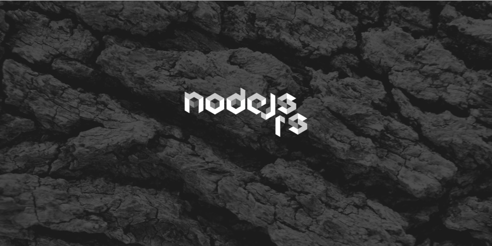

# New nodejs.rs (WIP)

  

NodeJS.rs is a Serbian JavaScript/NodeJS community portal meant for sharing knowledge, information and general joy.

This community is totally governed by the group of enthusiast that find daily dose of joy in sharing their passion in programming and hacking.